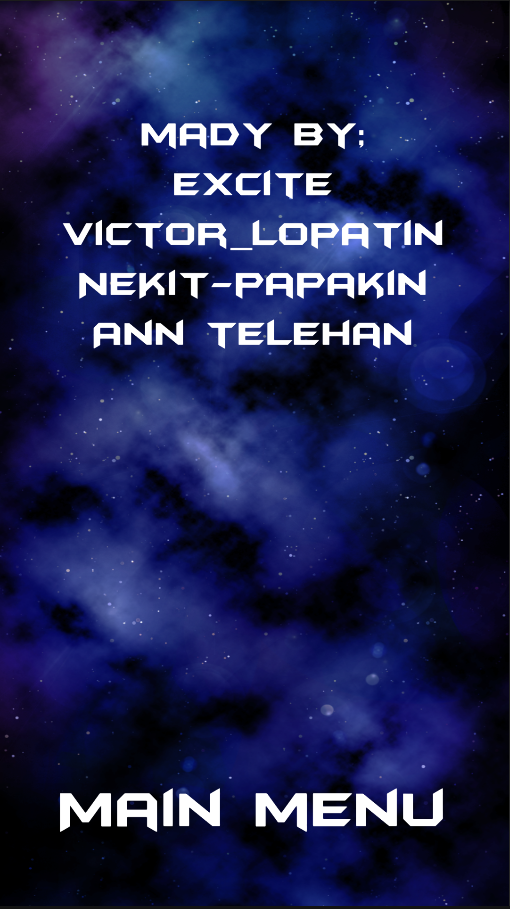
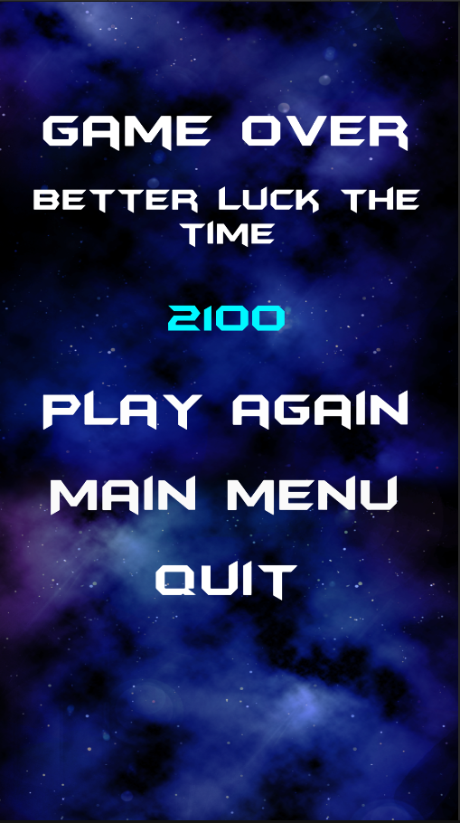

# StarGame

StarGame - a university gamedevelopment project. The main project purpose is to get some communications skills during the development process.

The main game's purpose is very simple: you are a pilot of a starship that explore the galaxy. Exploration is not a safe business, so you must be ready to protect yourself. Destroy all the enemies to get as much points as possible, and don't forget about useful bonuses.

The latest application version you can get there: https://drive.google.com/drive/folders/1m_lnzSYr5_CseGzGivCkVP0lGLk1Nw2D

​
​
​
​
​

Some new features might be realised soon.

If you have any suggestuon, contact me excitenew@gmail.com
